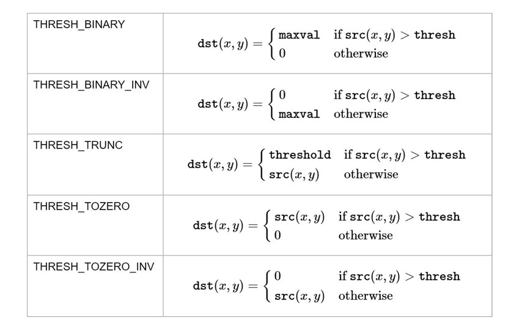

### 安装

```bash
pip install opencv-python
```

加载图片

```python
# 加载灰度图
img = cv2.imread('lena.jpg', 0)
```

显示图片

```python
cv2.imshow('lena', img) #参数 1 是窗口的名字，参数 2 是要显示的图片
cv2.waitKey(0) # 参数是等待时间（毫秒 ms）,0表示一直等待, == ord("q")
```

保存图片

```python
cv2.imwrite('lena_gray.jpg', img)
```

### 打开摄像图

```python
# 打开摄像头并灰度化显示
import cv2

capture = cv2.VideoCapture(0)  # 0表示摄像图编号

while True:
    # 获取一帧
    ret, frame = capture.read()
    # 将这帧转换为灰度图
    gray = cv2.cvtColor(frame, cv2.COLOR_BGR2GRAY)

    cv2.imshow('frame', gray)
    if cv2.waitKey(1) == ord('q'): #    delay (可选): 延迟时间，单位为毫秒。默认值为 0，表示无限期等待，直到有键盘输入。
        break
```

通过`cap.get(propId)`可以获取摄像头的一些属性，比如捕获的分辨率，亮度和对比度等。propId 是从 0~18 的数字，代表不同的属性，完整的属性列表可以参考：[VideoCaptureProperties](https://docs.opencv.org/4.0.0/d4/d15/group__videoio__flags__base.html#gaeb8dd9c89c10a5c63c139bf7c4f5704d)。

```python
# 获取捕获的分辨率
# propId 可以直接写数字，也可以用 OpenCV 的符号表示
width, height = capture.get(3), capture.get(4)
print(width, height)

# 以原分辨率的一倍来捕获
capture.set(cv2.CAP_PROP_FRAME_WIDTH, width * 2)
capture.set(cv2.CAP_PROP_FRAME_HEIGHT, height * 2)
```

### 播放本地视频

```python
# 播放本地视频
capture = cv2.VideoCapture('demo_video.mp4')

while capture.isOpened():
    ret, frame = capture.read()
    gray = cv2.cvtColor(frame, cv2.COLOR_BGR2GRAY)

    cv2.imshow('frame', gray)
    # 参数表示暂停时间，所以这个值越大，视频播放速度越慢，反之，播放速度越快，通常设置为25或30
    if cv2.waitKey(30) == ord('q'):
        break
```

### 录制视频

```python
capture = cv2.VideoCapture(0)

# 定义编码方式(四字节码)并创建 VideoWriter 对象
fourcc = cv2.VideoWriter_fourcc(*'MJPG')# cv2.VideoWriter_fourcc('M','J','P','G')
outfile = cv2.VideoWriter('output.avi', fourcc, 25., (640, 480))

while capture.isOpened():
    ret, frame = capture.read()

    if ret:
        outfile.write(frame)  # 写入文件
        cv2.imshow('frame', frame)
        if cv2.waitKey(1) == ord('q'):
            break
    else:
        break
```

### 获取和修改像素点值

通过行列的坐标来获取某像素点的值，对于彩色图，结果是 B,G,R 三个值的列表，对于灰度图或单通道图，只有一个值：

```python
px = img[100, 90]
print(px)  # [103 98 197]

# 只获取蓝色 blue 通道的值
px_blue = img[100, 90, 0]
print(px_blue)  # 103

# 修改像素值
img[100, 90] = [255, 255, 255]
print(img[100, 90])  # [255 255 255]
```

### 图片属性

```python
print(img.shape)  # (263, 247, 3)
# 形状中包括行数、列数和通道数
height, width, channels = img.shape
# img 是灰度图的话：height, width = img.shape
```

### ROI

Region of Interest，感兴趣区域

```python
# 截取脸部 ROI
face = img[100:200, 115:188]
cv2.imshow('face', face)
cv2.waitKey(0)
```

### 通道分割与合并

```python
b, g, r = cv2.split(img)	# split
img = cv2.merge((b, g, r))	# merge
```

`split()`函数比较耗时，**更高效的方式是用 numpy 中的索引**，如提取 B 通道：

```python
b = img[:, :, 0]
cv2.imshow('blue', b)
cv2.waitKey(0)
```

### [颜色空间转换](https://codec.wang/docs/opencv/start/changing-colorspaces)

```python
import numpy as np

capture = cv2.VideoCapture(0)

# 蓝色的范围，不同光照条件下不一样，可灵活调整
lower_blue = np.array([100, 110, 110])
upper_blue = np.array([130, 255, 255])

while True:
    # 1.捕获视频中的一帧
    ret, frame = capture.read()

    # 2.从 BGR 转换到 HSV
    hsv = cv2.cvtColor(frame, cv2.COLOR_BGR2HSV)

    # 3.inRange()：介于 lower/upper 之间的为白色，其余黑色
    mask = cv2.inRange(hsv, lower_blue, upper_blue)

    # 4.只保留原图中的蓝色部分
    res = cv2.bitwise_and(frame, frame, mask=mask)

    cv2.imshow('frame', frame)
    cv2.imshow('mask', mask)
    cv2.imshow('res', res)

    if cv2.waitKey(1) == ord('q'):
        break
```

那蓝色的 HSV 值的上下限 lower 和 upper 范围是怎么得到的呢？其实很简单，我们先把标准蓝色的 BGR 值用`cvtColor()`转换下：

```python
blue = np.uint8([[[255, 0, 0]]])
hsv_blue = cv2.cvtColor(blue, cv2.COLOR_BGR2HSV)
print(hsv_blue)  # [[[120 255 255]]]
```

[HSV](https://baike.baidu.com/item/HSV/547122)是一个常用于颜色识别的模型

OpenCV 中色调 H 范围为[0,179]，饱和度 S 是[0,255]，明度 V 是[0,255]。虽然 H 的理论数值是 0°~360°，但 8 位图像像素点的最大值是 255，所以 OpenCV 中除以了 2

### 阈值分割

> 像素点值大于阈值变成一类值，小于阈值变成另一类值。

```python
import cv2

# 灰度图读入
img = cv2.imread('gradient.jpg', 0)

# 阈值分割
ret, th = cv2.threshold(img, 127, 255, cv2.THRESH_BINARY)
cv2.imshow('thresh', th)
cv2.waitKey(0)
```

- 参数 1：要处理的原图，**一般是灰度图**
- 参数 2：设定的阈值
- 参数 3：对于`THRESH_BINARY`、`THRESH_BINARY_INV`阈值方法所选用的最大阈值，一般为 255
- 参数 4：阈值的方式，主要有 5 种，详情：[ThresholdTypes](https://docs.opencv.org/4.0.0/d7/d1b/group__imgproc__misc.html#gaa9e58d2860d4afa658ef70a9b1115576)



### 自适应阈值

看得出来固定阈值是在整幅图片上应用一个阈值进行分割，*它并不适用于明暗分布不均的图片*。 `cv2.adaptiveThreshold()`自适应阈值会每次取图片的一小部分计算阈值，这样图片不同区域的阈值就不尽相同。它有 5 个参数，其实很好理解，先看下效果：

```python
# 自适应阈值对比固定阈值
img = cv2.imread('sudoku.jpg', 0)

# 固定阈值
ret, th1 = cv2.threshold(img, 127, 255, cv2.THRESH_BINARY)
# 自适应阈值
th2 = cv2.adaptiveThreshold(
    img, 255, cv2.ADAPTIVE_THRESH_MEAN_C, cv2.THRESH_BINARY, 11, 4)
th3 = cv2.adaptiveThreshold(
    img, 255, cv2.ADAPTIVE_THRESH_GAUSSIAN_C, cv2.THRESH_BINARY, 17, 6)

titles = ['Original', 'Global(v = 127)', 'Adaptive Mean', 'Adaptive Gaussian']
images = [img, th1, th2, th3]

for i in range(4):
    plt.subplot(2, 2, i + 1), plt.imshow(images[i], 'gray')
    plt.title(titles[i], fontsize=8)
    plt.xticks([]), plt.yticks([])
plt.show()
```

- 参数 1：要处理的原图
- 参数 2：最大阈值，一般为 255
- 参数 3：小区域阈值的计算方式
  - `ADAPTIVE_THRESH_MEAN_C`：小区域内取均值
  - `ADAPTIVE_THRESH_GAUSSIAN_C`：小区域内加权求和，权重是个高斯核
- 参数 4：阈值方法，只能使用`THRESH_BINARY`、`THRESH_BINARY_INV`，具体见前面所讲的阈值方法
- 参数 5：小区域的面积，如 11 就是 11*11 的小块
- 参数 6：最终阈值等于小区域计算出的阈值再减去此值

### Otsu 阈值法

大部分图像处理任务都需要先进行二值化操作，阈值的选取很关键，Otsu 阈值法会自动计算阈值。

[Otsu 阈值法](https://codec.wang/docs/opencv/start/extra-04-otsu-thresholding)（日本人大津展之提出的，也可称大津算法）非常适用于双峰图片


### 缩放图片

```python
# 按照指定的宽度、高度缩放图片
res = cv2.resize(img, (132, 150))
# 按照比例缩放，如 x,y 轴均放大一倍
res2 = cv2.resize(img, None, fx=2, fy=2, interpolation=cv2.INTER_LINEAR)
```

### 翻转图片

```python
dst = cv2.flip(img, 1)
```

### 平移图片

用仿射变换函数`cv2.warpAffine()`实现的

```python
# 定义平移矩阵，需要是 numpy 的 float32 类型
# x 轴平移 100，y 轴平移 50
M = np.float32([[1, 0, 100], [0, 1, 50]])
# 用仿射变换实现平移
dst = cv2.warpAffine(img, M, (cols, rows))
```

### 旋转图片

旋转同平移一样，也是用仿射变换实现的，因此也需要定义一个变换矩阵

OpenCV 直接提供了 `cv2.getRotationMatrix2D()`函数来生成这个矩阵，该函数有三个参数：

- 参数 1：图片的旋转中心
- 参数 2：旋转角度(正：逆时针，负：顺时针)
- 参数 3：缩放比例，0.5 表示缩小一半

```python
# 45°旋转图片并缩小一半
M = cv2.getRotationMatrix2D((cols / 2, rows / 2), 45, 0.5)
dst = cv2.warpAffine(img, M, (cols, rows))
```

### 绘图

`cv2.line()`, `cv2.circle()`, `cv2.rectangle()`, `cv2.ellipse()`, `cv2.putText()`

### 卷积

循环对**图像跟一个核逐个元素相乘再求和得到另外一副图像的操作**


### [平滑图像](https://codec.wang/docs/opencv/basic/smoothing-images)

模糊/平滑图片来消除图片噪声

#### 滤波与模糊

- 它们都属于卷积，不同滤波方法之间只是卷积核不同（对线性滤波而言）
- 低通滤波器是模糊，高通滤波器是锐化

#### 均值滤波

$$
kernel = \frac{1}{9} \begin{bmatrix} 1 & 1 & 1 \\ 1 & 1 & 1 \\ 1 & 1 & 1 \end{bmatrix}
$$

```python
blur = cv2.blur(img, (3, 3))  # 均值模糊
```

#### 方框滤波

```python
# 前面的均值滤波也可以用方框滤波实现：normalize=True
blur = cv2.boxFilter(img, -1, (3, 3), normalize=True)
```

#### 高斯滤波


$$
k = \begin{bmatrix}
0.0625 & 0.125 & 0.0625 \\
0.125 & 0.25 & 0.125 \\
0.0625 & 0.125 & 0.0625
\end{bmatrix}
$$

```python
gaussian = cv2.GaussianBlur(img, (5, 5), 1)  # 高斯滤波
```

#### 中值滤波

```python
median = cv2.medianBlur(img, 5)  # 中值滤波
```

#### 双边滤波

```python
blur = cv2.bilateralFilter(img, 9, 75, 75)  # 双边滤波
```

### [边缘检测](https://codec.wang/docs/opencv/basic/edge-detection)

```python
import cv2
import numpy as np

img = cv2.imread('handwriting.jpg', 0)
edges = cv2.Canny(img, 30, 70)  # canny 边缘检测

cv2.imshow('canny', np.hstack((img, edges)))
cv2.waitKey(0)
```

`cv2.Canny()` 函数用于 Canny 边缘检测，它接受以下参数：

**可选参数：**

* **threshold1:**  第一个阈值，用于滞后阈值处理。较低的阈值用于检测潜在的边缘像素。
* **threshold2:** 第二个阈值，也用于滞后阈值处理。较高的阈值用于确认哪些边缘像素是真正的边缘。**`threshold2` 应大于 `threshold1`** 。
* **apertureSize:**  用于计算图像梯度的 Sobel 算子的孔径大小。默认值为 3。
* **L2gradient:**  一个布尔值，指示是否使用更精确的 L2 范数来计算图像梯度幅值。如果为 `False`，则使用 L1 范数。默认值为 `False`。

**参数详解：**

* **滞后阈值处理：** Canny 算法使用双阈值方法来检测边缘。首先，它使用 `threshold1` 和 `threshold2` 来识别强边缘和弱边缘。然后，它将连接到强边缘的弱边缘连接起来，形成最终的边缘图像。
* **Sobel 算子：** `apertureSize` 参数控制用于计算图像梯度的 Sobel 算子的孔径大小。更大的孔径可以检测到更明显的边缘，但也会增加计算量。
* **梯度范数：**  `L2gradient` 参数控制用于计算图像梯度幅值的范数类型。L2 范数比 L1 范数更精确，但计算量也更大。

### 算子

https://blog.csdn.net/wsp_1138886114/article/details/81368890

除了 Sobel 算子，还有很多其他的边缘检测算子和图像梯度算子，它们各有优缺点，适用于不同的场景。以下是一些常见的：

**一阶微分算子:**

* **Sobel 算子:**  一种常用的边缘检测算子，它使用 3x3 的卷积核来计算图像的梯度。Sobel 算子可以有效地检测垂直和水平边缘，对噪声也有一定的鲁棒性。

  ```python
  Sobel_x =  [[-1, 0, 1],            
  			[-2, 0, 2],            
  			[-1, 0, 1]] 
  Sobel_y =  [[-1, -2, -1],            
  			[0,  0,  0],            
  			[1,  2,  1]]
  ```

* **Prewitt 算子:**  与 Sobel 算子非常相似，但使用了不同的卷积核。Prewitt 算子对噪声的敏感度略低于 Sobel 算子，但检测到的边缘可能略厚一些。

* **Roberts 算子:**  使用 2x2 的卷积核，计算速度更快，但对噪声更敏感，通常用于检测对角线边缘。

* **Scharr 算子:**  Sobel 算子的改进版本，对图像的旋转不变性更好。它在保持精度的前提下提供了更好的方向性。


**二阶微分算子:**

* **Laplacian 算子:**  一种二阶微分算子，对图像中的灰度突变非常敏感，可以用来检测边缘和角点。对噪声非常敏感。
* **Laplacian of Gaussian (LoG):**  先用高斯滤波器平滑图像，然后再应用拉普拉斯算子。这可以减少噪声的影响，并提供更准确的边缘检测。
* **Difference of Gaussians (DoG):**  用不同标准差的两个高斯滤波器对图像进行卷积，然后将结果相减。DoG 算子可以近似 LoG 算子，计算效率更高。


**其他边缘检测算子:**

* **Canny 边缘检测器:**  一种多阶段边缘检测算法，可以有效地检测边缘，同时抑制噪声。它通常被认为是性能最佳的边缘检测器之一。
* **SUSAN 算子:**  (Smallest Univalue Segment Assimilating Nucleus)  一种基于区域的边缘检测器，对噪声具有较好的鲁棒性。
* **Zerocross:** 通过寻找二阶导数的零交叉点来检测边缘,通常和LoG一起使用.

**方向梯度直方图 (HOG):**

* **HOG (Histogram of Oriented Gradients):**  一种特征描述子，用于目标检测和图像识别。它计算图像局部区域中梯度方向的直方图，可以捕捉图像的纹理和形状特征。


**选择合适的算子的建议:**

* 对于需要快速计算且对噪声不太敏感的场景，可以使用 Prewitt 算子。
* 对于需要更高精度和更好方向性的场景，可以使用 Scharr 算子。
* 对于需要检测对角线边缘的场景，可以使用 Roberts 算子。
* 对于需要检测边缘和角点的场景，可以使用 Laplacian 算子，但需要注意噪声的影响。
* 对于需要在抑制噪声的同时有效地检测边缘的场景，可以使用 Canny 边缘检测器或 SUSAN 算子。
* 对于需要提取图像特征用于目标检测和图像识别的场景，可以使用 HOG 特征描述子。

### 腐蚀与膨胀

#### 腐蚀

```python
import cv2
import numpy as np

img = cv2.imread('j.bmp', 0)
kernel = np.ones((5, 5), np.uint8)
erosion = cv2.erode(img, kernel)  # 腐蚀
```

#### 膨胀

```python
dilation = cv2.dilate(img, kernel)  # 膨胀
```

#### 开/闭运算

先腐蚀后膨胀叫开运算（因为先腐蚀会分开物体，这样容易记住），其作用是：分离物体，消除小区域。这类形态学操作用`cv2.morphologyEx()`函数实现：

```python
kernel = cv2.getStructuringElement(cv2.MORPH_RECT, (5, 5))  # 定义结构元素

img = cv2.imread('j_noise_out.bmp', 0)
opening = cv2.morphologyEx(img, cv2.MORPH_OPEN, kernel)  # 开运算
```

闭运算则相反：先膨胀后腐蚀（先膨胀会使白色的部分扩张，以至于消除/"闭合"物体里面的小黑洞，所以叫闭运算）

```python
img = cv2.imread('j_noise_in.bmp', 0)
closing = cv2.morphologyEx(img, cv2.MORPH_CLOSE, kernel)  # 闭运算
```


### 轮廓

```python
import cv2

img = cv2.imread('handwriting.jpg')
img_gray = cv2.cvtColor(img, cv2.COLOR_BGR2GRAY)
ret, thresh = cv2.threshold(img_gray, 0, 255, cv2.THRESH_BINARY_INV + cv2.THRESH_OTSU)

# 寻找二值化图中的轮廓
image, contours, hierarchy = cv2.findContours(
    thresh, cv2.RETR_TREE, cv2.CHAIN_APPROX_SIMPLE)
print(len(contours))  # 结果应该为 2
# 函数有 3 个返回值，image 还是原来的二值化图片，hierarchy 是轮廓间的层级关系（番外篇：轮廓层级），这两个暂时不用理会。我们主要看 contours，它就是找到的轮廓了，以数组形式存储，记录了每条轮廓的所有像素点的坐标(x,y)。

# 绘制轮廓， 参数 3 表示要绘制哪一条轮廓，-1 表示绘制所有轮廓，参数 4 是颜色（B/G/R 通道，所以(0,0,255) 表示红色），参数 5 是线宽
cv2.drawContours(img, contours, -1, (0, 0, 255), 2)
```

### [直方图](https://codec.wang/docs/opencv/basic/histograms)

### [图像相似度](https://blog.csdn.net/m0_61899108/article/details/127715737)

#### [直方图](https://blog.csdn.net/itanping/article/details/135295901)

```python
img1 = cv2.imread(img1_path)
img2 = cv2.imread(img2_path)

img1_hist = cv2.calcHist([img1], [0, 1, 2], None, [8, 8, 8], [0, 256, 0, 256, 0, 256])
img2_hist = cv2.calcHist([img2], [0, 1, 2], None, [8, 8, 8], [0, 256, 0, 256, 0, 256])

# 计算直方图相似度
# cv2.HISTCMP_BHATTACHARYYA: 巴氏距离比较，值越接近 0 表示颜色分布越相似
similarity = cv2.compareHist(img1_hist, img2_hist, cv2.HISTCMP_BHATTACHARYYA)
print(f"（HISTCMP_BHATTACHARYYA/巴氏距离）：", similarity)

# cv2.HISTCMP_CHISQR: 卡方比较，值越接近 0 表示颜色分布越相似
similarity = cv2.compareHist(img1_hist, img2_hist, cv2.HISTCMP_CHISQR)
print(f"HISTCMP_CHISQR/卡方比较）：", similarity)

# cv2.HISTCMP_CORREL: 相关性比较，值越接近 1 表示颜色分布越相似
similarity = cv2.compareHist(img1_hist, img2_hist, cv2.HISTCMP_CORREL)
print(f"（HISTCMP_CORREL/相关性）：", similarity)

# cv2.HISTCMP_INTERSECT: 直方图交集比较，值越大表示颜色分布越相似
similarity = cv2.compareHist(img1_hist, img2_hist, cv2.HISTCMP_INTERSECT)
print(f"HISTCMP_INTERSECT/交集比较）：", similarity)

```

#### [结构相似性（SSIM）](https://blog.csdn.net/hedgehog__/article/details/107257755)

#### 均方误差（MSE）

值越小，相似度越高，取值为0-64

```python
from skimage.metrics import structural_similarity
from skimage.metrics import mean_squared_error as mse
import cv2
# 读取图片
img1 = cv2.imread('path/to/image1')
img2 = cv2.imread('path/to/image2')

# 计算MSE
mse = ((img1 - img2) ** 2).mean()
# 计算SSIM
ssim = structural_similarity(img1, img2, channel_axis=2)

print('MSE:', mse)
print('SSIM:', ssim)
```

#### 峰值信噪比 PSNR

（Peak Signal-to-Noise Ratio）

- PSNR高于40dB说明图像质量极好（即非常接近原始图像）；
- 在30—40dB通常表示图像质量是好的（即失真可以察觉但可以接受）；
- 在20—30dB说明图像质量差；
- 最后，PSNR低于20dB图像不可接受。

```python
# 方法一：自定义函数 
import numpy
import math
def psnr(img1, img2):
    mse = numpy.mean( (img1 - img2) ** 2 )
    if mse == 0:
        return 100
    PIXEL_MAX = 255.0
    return 20 * math.log10(PIXEL_MAX / math.sqrt(mse))

# 调用库函数
from skimage.metrics import peak_signal_noise_ratio as psnr
```

#### [感知哈希算法](https://blog.csdn.net/itanping/article/details/134022715) Phash

Perceptual hash algorithm 它的作用是对每张图片生成一个"指纹"（fingerprint）字符串，然后比较不同图片的指纹。结果越接近，就说明图片越相似。["汉明距离"](https://zh.wikipedia.org/wiki/汉明距离)（Hamming distance）

